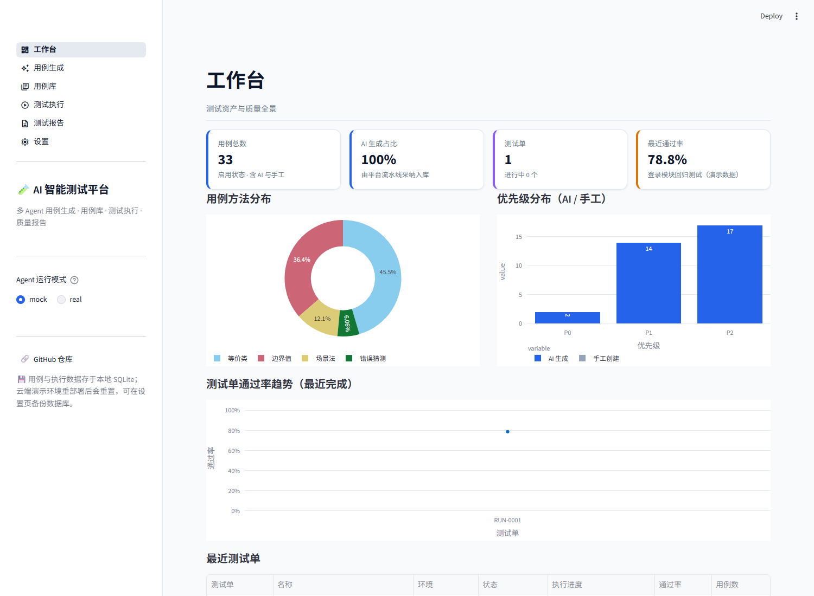
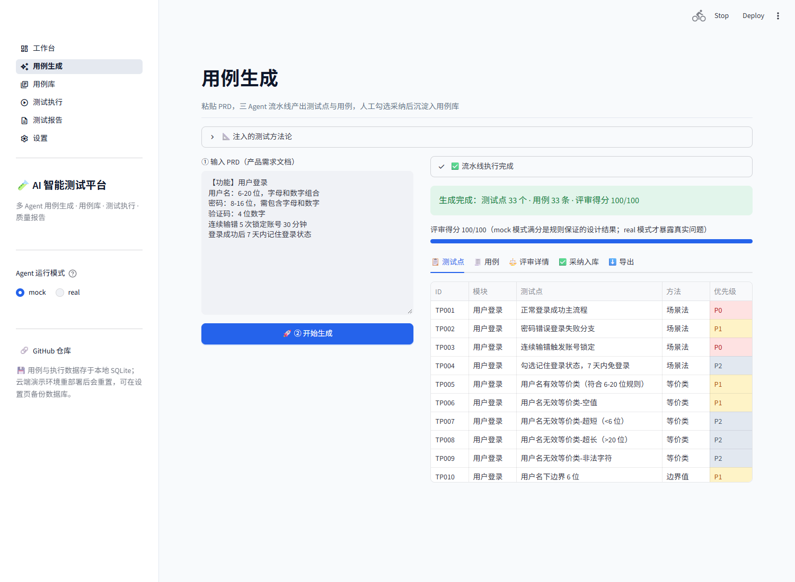
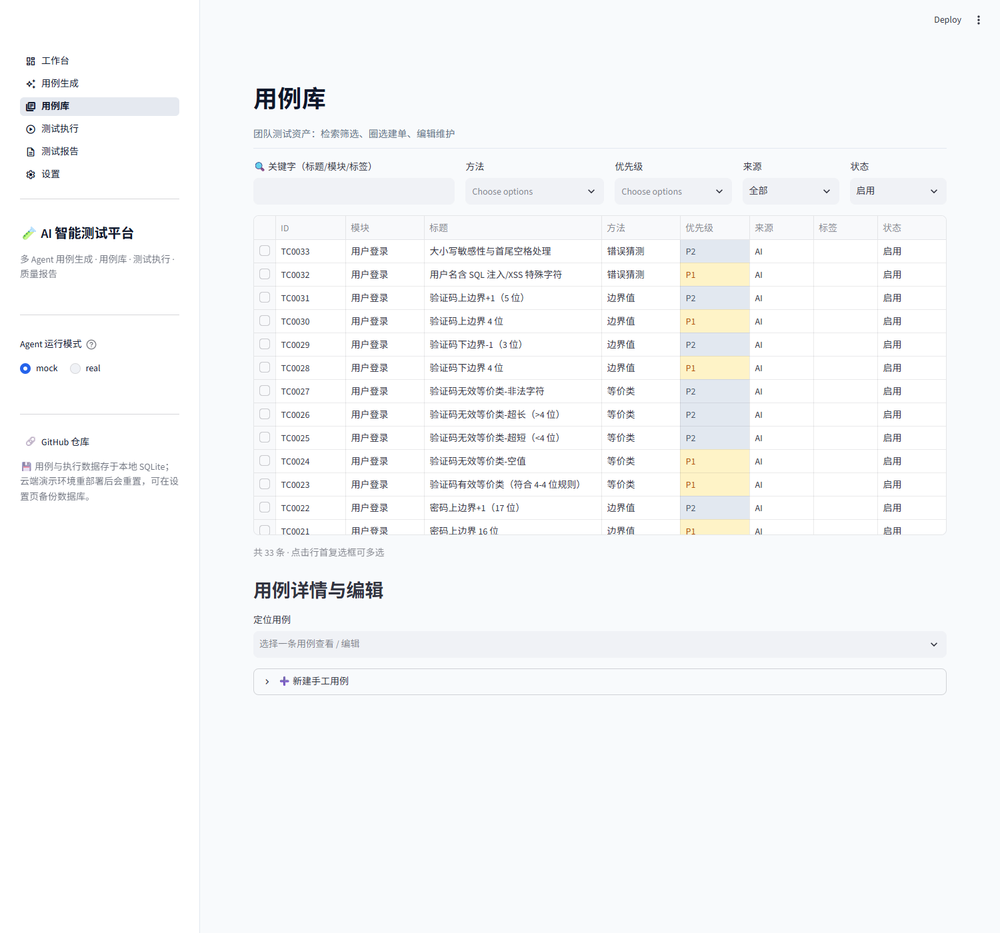
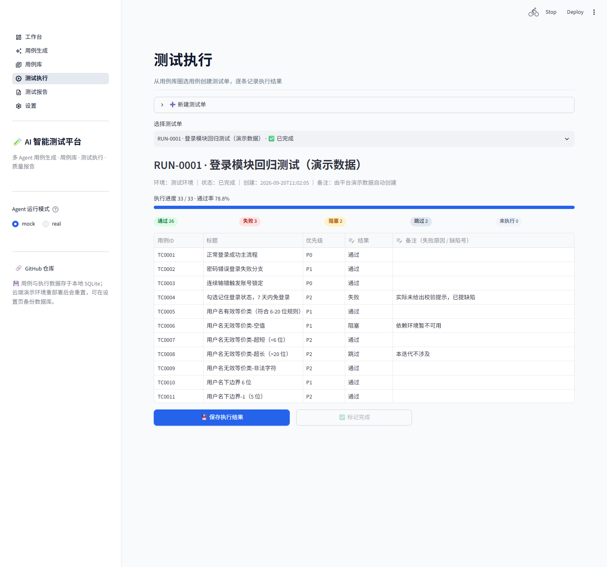
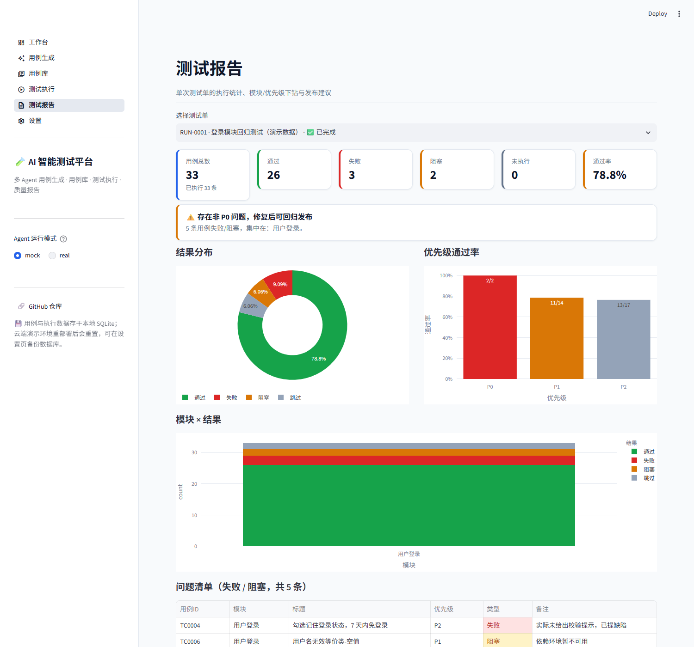
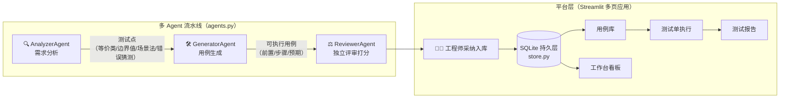

# AI 智能测试平台（testcase-agent）

[](https://github.com/shian555/testcase-agent/actions/workflows/ci.yml)
[](https://testcase-agent.streamlit.app)

基于 LLM 多 Agent 的测试用例平台：不止"生成"，而是覆盖 **用例生成 → 采纳入库 → 用例库 → 测试执行 → 质量报告** 的完整业务闭环，对标 TestRail / PingCode / 禅道的企业级测试管理流程。

> **🌐 在线 Demo（免安装，点开即用）**：[https://testcase-agent.streamlit.app](https://testcase-agent.streamlit.app)

> 一个项目同时证明：**测试平台设计能力**（测试用例设计方法论 + 测试管理闭环，测开岗）+ **多 Agent 协同 / LLM 工程化**（AI 应用开发岗）。

## 成果展示

| 工作台看板 | 用例生成（三 Agent 流水线） | 用例库（筛选 / 圈选建单） |
|---|---|---|
|  |  |  |

| **测试执行**（逐条记录结果） | **测试报告**（统计 + 发布建议） |
|---|---|
|  |  |

单份登录 PRD 自动产出 **33 个测试点 / 33 条可执行用例 / 评审 100 分**，命令行一条命令可复现（见下）。

## 业务闭环

```
用例生成（PRD → 测试点 → 用例 → AI 评审）
   → 人机协同采纳入库（工程师勾选把关，mock/real 皆可入库）
      → 用例库（筛选 / 编辑 / 停用 / 圈选建测试单）
         → 测试执行（通过 / 失败 / 阻塞 / 跳过 + 备注）
            → 测试报告（通过率 / 模块下钻 / 发布建议 / Excel·MD 导出）
               → 工作台看板（KPI / 分布 / 通过率趋势）
```

与"生成完就丢"的 Demo 不同：AI 产出必须经**人工勾选采纳**才进入用例库（人机协同），用例 ID 全局唯一不复用、测试点 ID 全程可追溯——这是成熟测试平台的基本法。

## 六个页面

| 页面 | 能力 |
|---|---|
| **工作台** | 用例总数 / AI 占比 / 测试单 / 最近通过率 4 张 KPI 卡，方法分布环形图、优先级×来源堆叠柱、通过率趋势折线、最近测试单表；空库一键填充演示数据 |
| **用例生成** | 粘贴 PRD → AnalyzerAgent → GeneratorAgent → ReviewerAgent 全程可视化，5 个页签（测试点 / 用例 / 评审详情 / **采纳入库** / 导出 CSV·MD·Excel） |
| **用例库** | 关键字 + 方法 + 优先级 + 来源 + 状态组合筛选；多选圈选 → 直接建测试单；单条详情 / 表单编辑 / 停用 / 删除；新建手工用例 |
| **测试执行** | 从用例库圈选创建测试单；执行面板：进度条、结果 pill 统计、逐条结果下拉 + 失败备注；未执行清零才能"标记完成"；Excel 执行报表 |
| **测试报告** | 6 项 KPI + 规则化发布建议（P0 失败 ⛔不建议发布）+ 结果分布 / 优先级通过率 / 模块×结果三张图 + 失败问题清单 + Excel / Markdown 导出 |
| **设置** | LLM 环境检测与连接测试、演示数据 / 清空 / SQLite 备份下载、测试方法论说明 |

## 架构



- **核心 Agent 层**（`models / methods / agents / pipeline`）：mock 规则引擎与 real LLM 双模式，接口一致，可脱离网页用 `run.py` 复现。
- **平台层**（`store / styles / excel_export / views`）：纯标准库 `sqlite3` 持久层（WAL、外键、事务），openpyxl 生成与网页同配色的 Excel 报表，六个页面各自独立。

## 快速开始

```bash
pip install -r requirements.txt

python run.py                        # ① 命令行：mock 模式离线跑通，产出 report.md + test_cases.csv
python -m streamlit run app.py       # ② 平台：工作台 → 填充演示数据 或 直接生成 → 采纳 → 建单 → 执行 → 报告
python -m pytest tests/ -v           # ③ 单测（流水线契约 + 持久层 CRUD）
```

默认 `mock` 模式用规则化 Agent（确定性、可复现、无需 API Key），用来验证链路与方法论注入是否正确。

## 测试方法论（methods.py）

生成流程显式注入四种方法：**等价类 / 边界值 / 场景法 / 错误猜测**，每条用例都标注 `method`，可追溯到测试点。

## 接入真实 LLM

```bash
$env:LLM_API_KEY="你的 Key"
$env:LLM_BASE_URL="https://dashscope.aliyuncs.com/compatible-mode/v1"
$env:LLM_MODEL="qwen2.5-7b-instruct"
python run.py --mode real           # 命令行
# 或侧边栏把 Agent 运行模式切换 mock → real（设置页可一键测试连接）
```

## 评审标准（ReviewerAgent）

1. 方法覆盖（等价类/边界值/场景法/错误猜测）
2. 结构完整性（前置/步骤/预期）
3. 优先级标注（P0/P1/P2）
4. 可追溯性（用例关联测试点）
5. 边界值完整性（上下界±1）

## 数据与导出

- 用例与执行记录存于本地 SQLite（`data/platform.db`，首次运行自动建表）；**设置页**可一键下载 `.db` 备份。
- 三套 Excel 报表（生成报告 / 用例库 / 执行报表）与网页同配色：蓝底白字表头、冻结首行、优先级/结果色块。
- Streamlit Cloud 为只读文件系统、重部署即清库：演示环境数据仅供体验，可在工作台一键重建。

## 诚实声明

- 当前 `mock` 模式是理想输出，评审 100 分是设计使然，只证明链路正确。
- 接入真实 LLM 后才会暴露真实问题（用例遗漏、结构不规范、方法缺失），**评审 Agent 的打分才有意义**。
- 所有数字（测试点/用例数/评审分）都能用 `python run.py` 现场复现。

## 简历 bullet（可直接套用，替换数字）

> 设计并实现 AI 驱动的测试用例管理平台，覆盖「用例生成 → 人机协同采纳 → 用例库 → 测试执行 → 质量报告」完整闭环；
> 生成侧基于 LLM 多 Agent（需求分析 / 用例生成 / 独立评审）显式注入等价类、边界值、场景法、错误猜测四种方法；
> 管理侧实现 SQLite 持久化、圈选建单、执行进度追踪、规则化发布建议与 Excel 报表导出；
> 单份 PRD 自动产出 33 个测试点 / 33 条可执行用例，用例设计效率较人工提升 X 倍。

## 待办 / 进阶

- [ ] 用例直出为 Pytest/Playwright 可执行脚本（对接 eval 项目形成自动化闭环）
- [ ] 对接 Jira / 禅道等外部缺陷与需求系统
- [ ] 多人协作（账号体系、用例评审流）
- [ ] CI 触发回归测试单并回写报告
