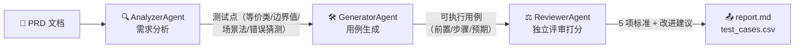

# AI 测试用例生成 Agent

[](https://github.com/shian555/testcase-agent/actions/workflows/ci.yml)
[](https://testcase-agent.streamlit.app)

基于 LLM 的测试用例生成多 Agent 系统：**PRD 解析 → 测试点提炼 → 用例生成 → 独立评审打分**，附 Streamlit 可视化演示。

> **🌐 在线 Demo（免安装，点开即用）**：[https://testcase-agent.streamlit.app](https://testcase-agent.streamlit.app)

> 一个项目同时证明：**会用 AI 构建测试流程**（测开岗）+ **多 Agent 协同 / LLM 工程化**（AI开发岗）。

## 成果展示

粘贴任意 PRD，点击一个按钮，三个 Agent 依次执行，在线查看 / 筛选 / 下载用例：

| 输入 PRD → 一键生成 | 流水线执行完成（指标总览） | 用例表格（按方法/优先级筛选） |
|---|---|---|
|  |  |  |

单份登录 PRD 自动产出 **33 个测试点 / 33 条可执行用例 / 评审 100 分**，命令行一条命令可复现（见下）。

## 架构



## 快速开始

```bash
pip install -r requirements.txt

python run.py                        # ① 命令行：mock 模式离线跑通，产出 report.md + test_cases.csv
python -m streamlit run app.py       # ② 网页 Demo：粘贴 PRD → 一键生成 → 在线查看/筛选/下载
python -m pytest tests/test_pipeline.py -v   # ③ 单测
```

默认 `mock` 模式用规则化 Agent（确定性、可复现、无需 API Key），用来验证链路与方法论注入是否正确。

## 测试方法论（methods.py）

生成流程显式注入四种方法：**等价类 / 边界值 / 场景法 / 错误猜测**，每条用例都标注 `method`，可追溯到测试点。

## 接入真实 LLM

```bash
$env:LLM_API_KEY="你的 Key"
$env:LLM_BASE_URL="https://dashscope.aliyuncs.com/compatible-mode/v1"
$env:LLM_MODEL="qwen2.5-7b-instruct"
python run.py --mode real           # 命令行
# 或网页侧边栏切换 mock → real
```

## 评审标准（ReviewerAgent）

1. 方法覆盖（等价类/边界值/场景法/错误猜测）
2. 结构完整性（前置/步骤/预期）
3. 优先级标注（P0/P1/P2）
4. 可追溯性（用例关联测试点）
5. 边界值完整性（上下界±1）

## 诚实声明

- 当前 `mock` 模式是理想输出，评审 100 分是设计使然，只证明链路正确。
- 接入真实 LLM 后才会暴露真实问题（用例遗漏、结构不规范、方法缺失），**评审 Agent 的打分才有意义**。
- 所有数字（测试点/用例数/评审分）都能用 `python run.py` 现场复现。

## 简历 bullet（可直接套用，替换数字）

> 基于 LLM 构建测试用例生成多 Agent 系统，串联「需求分析 → 测试点提炼 → 用例生成 → 独立评审打分」；
> 显式注入等价类/边界值/场景法/错误猜测四种方法，独立评审 Agent 按 5 项标准打分；
> 单份 PRD 自动产出 33 个测试点 / 33 条可执行用例并导出 Excel，附 Streamlit 可视化演示页，
> 用例生成效率较人工提升 X 倍。

## 待办 / 进阶

- [ ] 接入真实检索/大模型，替换 mock
- [ ] 扩展为多 Agent（生成 Agent + 对抗评审 Agent 分离）
- [ ] 用例直出为 Pytest/Playwright 可执行脚本（对接 eval 项目形成闭环）
